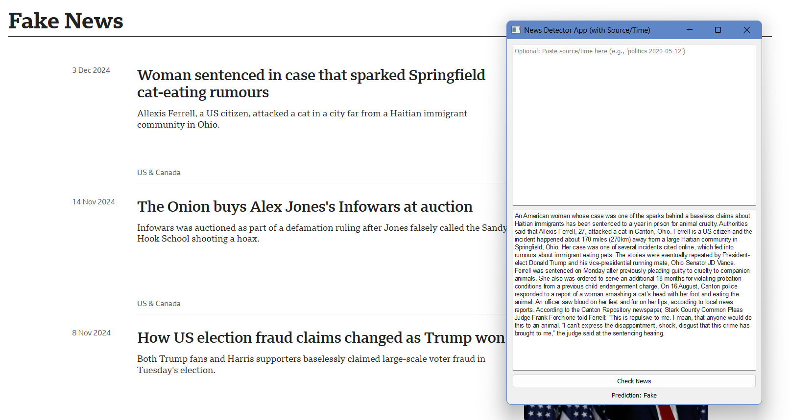
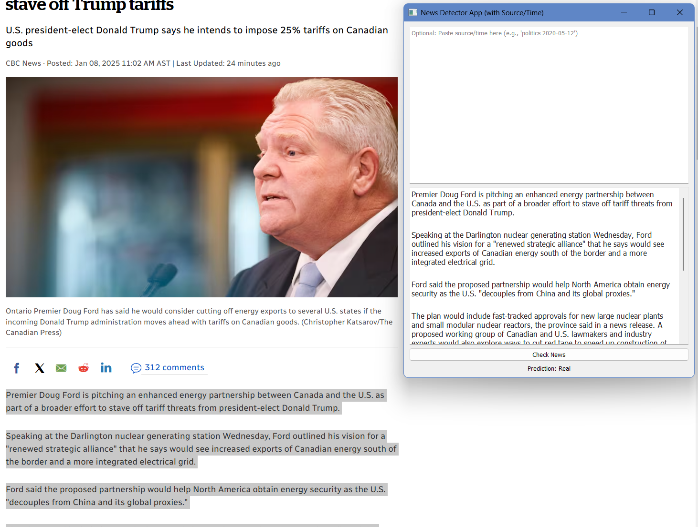

# Fake and Real News Detection

A **Logistic Regression-based model** to classify news articles as **fake** or **real** using text data from the [Fake and Real News Dataset](https://www.kaggle.com/datasets/clmentbisaillon/fake-and-real-news-dataset).

## Steps:
1. **Load Data**: Combine `Fake.csv` (labeled as `1`) and `True.csv` (labeled as `0`).
2. **EDA**:
   - Analyze label distribution and word count.
   - Example visualizations:
     - 
     - 
3. **Preprocessing**:
   - Clean text (remove punctuation, URLs, lowercase).
4. **TF-IDF Vectorization**:
   - Extract text features using `TfidfVectorizer` with 10,000 features.
5. **Model Training**:
   - Train a `LogisticRegression` model (`solver="saga"`, `max_iter=300`).
6. **Evaluation**:
   - Achieve **98.99% accuracy** and save predictions in `fake_real_submission.csv`.

## How to Run:
1. Clone the repository:

   git clone <repository_url>
   cd <repository_folder>

2. Install dependencies:
    
    pip install -r requirements.txt

3. Run the traing:

    python fpython news_training.py

4. Run the app:

    python main.py